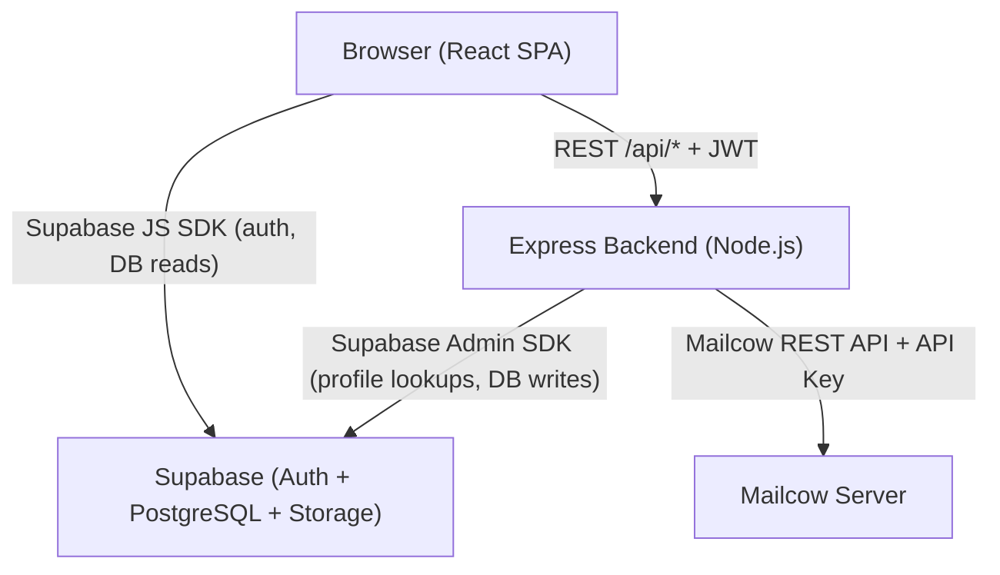
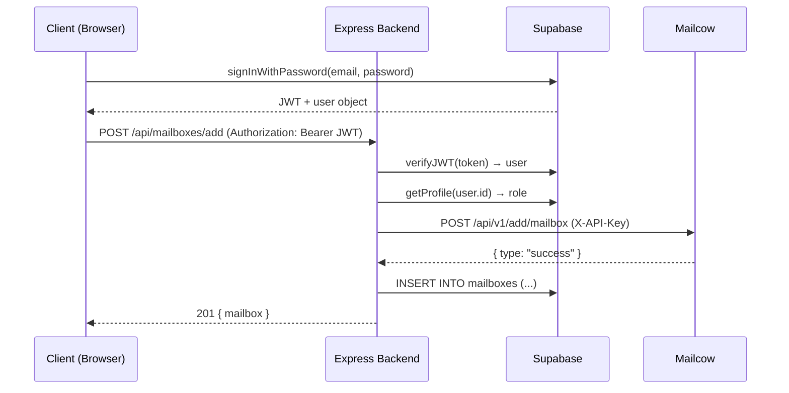

# Design Document: Mailcow Hosting Dashboard

## Overview

The Mailcow Hosting Dashboard is a full-stack web application that provides two distinct interfaces: an Admin Dashboard for internal staff and a Client Portal for hosted email customers. The system proxies all Mailcow API interactions through a Node.js/Express backend, keeping credentials server-side, and uses Supabase for authentication, role management, and persistent data storage.

The application is a single-page application (SPA) built with React (Vite) on the frontend and Node.js/Express on the backend. Authentication is handled entirely by Supabase Auth with JWT tokens passed in the `Authorization` header on every API request. Role-based routing splits users into two distinct experiences at login time.

### Key Design Decisions

- **Proxy-first API design**: The Mailcow API key never leaves the server. All Mailcow operations go through `/api/*` endpoints that verify the caller's JWT before forwarding to Mailcow.
- **Supabase as source of truth for business data**: Client records, invoices, mailboxes, and support tickets live in Supabase (PostgreSQL). Mailcow is the operational email server; Supabase is the billing/CRM layer.
- **Role-based routing at the React level**: After login, the frontend reads the user's role from the Supabase profile and redirects accordingly. Route guards protect `/admin/*` and `/portal/*` from unauthorized access.
- **Dark theme design system**: A single CSS custom-property theme is applied globally, ensuring visual consistency across all components.

---

## Architecture



### Request Flow



### Deployment Topology

- Frontend: Static files served by Vite dev server (dev) or a CDN/static host (prod)
- Backend: Node.js process on port 3000 (configurable via `PORT`)
- Database: Supabase hosted PostgreSQL
- Email server: Self-hosted Mailcow instance

---

## Components and Interfaces

### Frontend Component Tree

```
src/
├── pages/
│   ├── LandingPage.tsx            # Public landing page at /
│   ├── auth/
│   │   └── LoginPage.tsx
│   ├── admin/
│   │   ├── OverviewPage.tsx
│   │   ├── ClientsPage.tsx
│   │   ├── ClientDetailPage.tsx
│   │   ├── MailboxesPage.tsx
│   │   ├── InvoicesPage.tsx
│   │   ├── LeadsPage.tsx          # /admin/leads — leads management
│   │   └── SettingsPage.tsx
│   └── portal/
│       ├── PortalDashboardPage.tsx
│       ├── PortalMailboxesPage.tsx
│       ├── PortalAccountPage.tsx
│       ├── PortalInvoicesPage.tsx
│       └── PortalSupportPage.tsx
├── components/
│   ├── shared/
│   │   ├── Toast.tsx
│   │   ├── SkeletonLoader.tsx
│   │   ├── EmptyState.tsx
│   │   ├── StatusBadge.tsx
│   │   ├── PlanBadge.tsx
│   │   ├── SlideOver.tsx
│   │   ├── MailcowBanner.tsx
│   │   ├── ProtectedRoute.tsx
│   │   └── FloatingWhatsApp.tsx   # Fixed bottom-right, pulse animation, hidden on /admin/*
│   ├── landing/
│   │   ├── LandingNav.tsx         # Sticky nav, scroll-aware background change
│   │   ├── HeroSection.tsx        # Heading, subheading, domain search bar, trust indicators
│   │   ├── DomainSearchBar.tsx    # Input + TLD dropdown + search button (click-only trigger, no debounce);
│   │   │                          #   spinner state during check; fade-in result pill; parallel .com check
│   │   │                          #   when .co.zw searched (side-by-side results); "Already taken" row with
│   │   │                          #   clickable alternative chips that auto-trigger new checks
│   │   ├── HowItWorks.tsx         # 3-step horizontal flow with dashed connectors
│   │   ├── PricingSection.tsx     # 3 plan cards with "Get started" → scroll + pre-select
│   │   ├── FeaturesSection.tsx    # 2-column grid of 4 feature blocks
│   │   ├── RegistrationForm.tsx   # 5-section ZISPA-compliant form at #register;
│   │   │                          #   pre-fills domain+TLD from hero search state; 800ms debounced
│   │   │                          #   availability check on domain field edit; inline green/red pill in form
│   │   └── LandingFooter.tsx      # Brand, links, copyright
│   ├── admin/
│   │   ├── AdminSidebar.tsx
│   │   ├── MetricCard.tsx
│   │   ├── ClientsTable.tsx
│   │   ├── MailboxesTable.tsx
│   │   ├── InvoicesTable.tsx
│   │   ├── AddClientForm.tsx
│   │   └── LeadsTable.tsx         # Expandable rows, status dropdown, convert + WhatsApp actions
│   └── portal/
│       ├── PortalNavbar.tsx
│       ├── MailboxRow.tsx
│       └── SupportTicketForm.tsx
├── hooks/
│   ├── useAuth.ts
│   ├── useToast.ts
│   ├── useClients.ts
│   ├── useMailboxes.ts
│   ├── useInvoices.ts
│   ├── useTickets.ts
│   └── useLeads.ts                # CRUD for leads table
├── lib/
│   ├── supabase.ts        # Supabase JS client
│   └── api.ts             # Typed fetch wrapper for /api/*
├── store/
│   └── authStore.ts       # Zustand store for auth state
└── types/
    └── index.ts           # Shared TypeScript types
```

### Backend Module Structure

```
server/
├── index.ts               # Express app bootstrap, middleware registration
├── middleware/
│   ├── auth.ts            # JWT verification via Supabase Admin SDK
│   ├── requireRole.ts     # Role-based access control
│   ├── rateLimiter.ts     # express-rate-limit: 10 req/IP/min for /api/domains/check
│   └── errorHandler.ts    # Global error handler
├── routes/
│   ├── domains.ts         # POST /api/domains/add, DELETE /api/domains/:domain, GET /api/domains/check (public)
│   ├── mailboxes.ts       # CRUD + password reset for mailboxes
│   ├── leads.ts           # POST /api/leads — public, no JWT required
│   └── stats.ts           # GET /api/stats/overview, /api/stats/mailbox/:email
└── services/
    ├── mailcow.ts         # Mailcow API client (reads env vars)
    └── domainCheck.ts     # WhoisJSON API client with in-memory cache (60s TTL)
```

#### Public Leads Endpoint

`POST /api/leads` is intentionally unauthenticated — it is called by the public landing page registration form. It validates the request body and inserts a record into the Supabase `leads` table with `status = 'new'`. No JWT middleware is applied to this route.

```typescript
// routes/leads.ts
router.post('/leads', async (req, res, next) => {
  // validate required fields, return 422 on failure
  // insert into supabase leads table
  // return 201 { id }
});
```

#### Public Domain Check Endpoint

`GET /api/domains/check` is intentionally unauthenticated — it is called by the public landing page and registration form. Rate limiting (10 req/IP/min via `express-rate-limit`) is applied at the route level. The handler delegates to `DomainCheckService`, which maintains an in-memory cache with a 60-second TTL to avoid redundant WhoisJSON API calls.

```typescript
// routes/domains.ts (addition)
router.get('/domains/check', domainCheckRateLimiter, async (req, res, next) => {
  // validate name + tld query params, return 422 on failure
  // delegate to domainCheckService.checkAvailability(name, tld)
  // return 200 { domain, available } or 503 on WHOIS_UNAVAILABLE
});
```

#### Domain Check Service

```typescript
// services/domainCheck.ts

interface DomainCheckService {
  checkAvailability(name: string, tld: string): Promise<{ domain: string; available: boolean }>;
}

// Cache entry shape
interface CacheEntry {
  available: boolean;
  cachedAt: number; // Date.now()
}
// TTL: 60_000ms
// Cache: Map<string, CacheEntry>
// Key format: `${name}${tld}` (e.g. "example.co.zw")
```

`WHOISJSON_API_KEY` is read exclusively from the server-side environment. It is never forwarded to the client in any response body or header.

### Key Interfaces

#### Auth Middleware

```typescript
// Attaches req.user (Supabase user) and req.profile (role) to every /api/* request
interface AuthenticatedRequest extends Request {
  user: SupabaseUser;
  profile: { id: string; role: 'admin' | 'client' };
}
```

#### Mailcow Service

```typescript
interface MailcowService {
  addDomain(domain: string): Promise<MailcowResponse>;
  deleteDomain(domain: string): Promise<MailcowResponse>;
  addMailbox(params: AddMailboxParams): Promise<MailcowResponse>;
  getMailboxes(domain: string): Promise<MailcowMailbox[]>;
  updateMailbox(email: string, attrs: Partial<MailcowMailbox>): Promise<MailcowResponse>;
  deleteMailbox(email: string): Promise<MailcowResponse>;
  resetPassword(email: string, password: string): Promise<MailcowResponse>;
  getOverviewStats(): Promise<MailcowStats>;
  getMailboxStats(email: string): Promise<MailcowMailboxStats>;
}
```

#### API Client (Frontend)

```typescript
// lib/api.ts — wraps fetch, injects JWT, throws typed errors
async function apiRequest<T>(
  method: string,
  path: string,
  body?: unknown
): Promise<T>
```

### Route Guards

`ProtectedRoute` wraps React Router routes and checks:
1. Is the user authenticated? If not → redirect to `/login`
2. Does the user have the required role? If not → render `<UnauthorisedPage />`

```tsx
<ProtectedRoute requiredRole="admin">
  <AdminLayout />
</ProtectedRoute>
```

---

## Data Models

### Supabase Tables

#### profiles
```sql
CREATE TABLE profiles (
  id          UUID PRIMARY KEY REFERENCES auth.users(id),
  role        TEXT NOT NULL CHECK (role IN ('admin', 'client')),
  full_name   TEXT,
  phone       TEXT,
  created_at  TIMESTAMPTZ DEFAULT now()
);
```

#### clients
```sql
CREATE TABLE clients (
  id                    UUID PRIMARY KEY DEFAULT gen_random_uuid(),
  profile_id            UUID REFERENCES profiles(id),
  company_name          TEXT NOT NULL,
  domain                TEXT NOT NULL UNIQUE,
  plan                  TEXT NOT NULL CHECK (plan IN ('starter', 'business', 'pro')),
  mailbox_limit         INTEGER NOT NULL DEFAULT 5,
  status                TEXT NOT NULL CHECK (status IN ('active', 'suspended', 'pending')),
  domain_registered_at  TIMESTAMPTZ,
  next_renewal_date     TIMESTAMPTZ,
  notes                 TEXT,
  created_at            TIMESTAMPTZ DEFAULT now()
);
```

#### mailboxes
```sql
CREATE TABLE mailboxes (
  id          UUID PRIMARY KEY DEFAULT gen_random_uuid(),
  client_id   UUID NOT NULL REFERENCES clients(id) ON DELETE CASCADE,
  email       TEXT NOT NULL UNIQUE,
  quota_mb    INTEGER NOT NULL DEFAULT 500,
  status      TEXT NOT NULL CHECK (status IN ('active', 'suspended')),
  created_at  TIMESTAMPTZ DEFAULT now()
);
```

#### invoices
```sql
CREATE TABLE invoices (
  id          UUID PRIMARY KEY DEFAULT gen_random_uuid(),
  client_id   UUID NOT NULL REFERENCES clients(id) ON DELETE CASCADE,
  amount      NUMERIC(10,2) NOT NULL,
  status      TEXT NOT NULL CHECK (status IN ('paid', 'unpaid', 'overdue')),
  due_date    TIMESTAMPTZ NOT NULL,
  paid_at     TIMESTAMPTZ,
  description TEXT,
  created_at  TIMESTAMPTZ DEFAULT now()
);
```

#### support_tickets
```sql
CREATE TABLE support_tickets (
  id          UUID PRIMARY KEY DEFAULT gen_random_uuid(),
  client_id   UUID NOT NULL REFERENCES clients(id) ON DELETE CASCADE,
  subject     TEXT NOT NULL,
  message     TEXT NOT NULL,
  status      TEXT NOT NULL CHECK (status IN ('open', 'in_progress', 'resolved')),
  created_at  TIMESTAMPTZ DEFAULT now()
);
```

#### leads
```sql
CREATE TABLE leads (
  id                  UUID PRIMARY KEY DEFAULT gen_random_uuid(),
  domain              TEXT,
  tld                 TEXT CHECK (tld IN ('.co.zw', '.com')),
  plan                TEXT,
  company_name        TEXT,
  registration_type   TEXT CHECK (registration_type IN ('company', 'individual', 'ngo')),
  business_reg_number TEXT,
  org_description     TEXT,
  contact_name        TEXT,
  contact_position    TEXT,
  contact_email       TEXT,
  contact_phone       TEXT,
  physical_address    TEXT,
  letterhead_ready    BOOLEAN,
  tc_confirmed        BOOLEAN,
  signed_letter_ready BOOLEAN,
  id_ready            BOOLEAN,
  status              TEXT NOT NULL DEFAULT 'new' CHECK (status IN ('new', 'contacted', 'converted', 'rejected')),
  notes               TEXT,
  created_at          TIMESTAMPTZ DEFAULT now()
);
```

The `leads` table has no RLS restrictions on INSERT (public submissions). Admin SELECT/UPDATE is restricted to users with `role = 'admin'`.

### TypeScript Types

```typescript
// types/index.ts

export type Role = 'admin' | 'client';
export type Plan = 'starter' | 'business' | 'pro';
export type ClientStatus = 'active' | 'suspended' | 'pending';
export type MailboxStatus = 'active' | 'suspended';
export type InvoiceStatus = 'paid' | 'unpaid' | 'overdue';
export type TicketStatus = 'open' | 'in_progress' | 'resolved';

export interface Profile {
  id: string;
  role: Role;
  full_name: string | null;
  phone: string | null;
  created_at: string;
}

export interface Client {
  id: string;
  profile_id: string | null;
  company_name: string;
  domain: string;
  plan: Plan;
  mailbox_limit: number;
  status: ClientStatus;
  domain_registered_at: string | null;
  next_renewal_date: string | null;
  notes: string | null;
  created_at: string;
}

export interface Mailbox {
  id: string;
  client_id: string;
  email: string;
  quota_mb: number;
  status: MailboxStatus;
  created_at: string;
}

export interface Invoice {
  id: string;
  client_id: string;
  amount: number;
  status: InvoiceStatus;
  due_date: string;
  paid_at: string | null;
  description: string | null;
  created_at: string;
}

export interface SupportTicket {
  id: string;
  client_id: string;
  subject: string;
  message: string;
  status: TicketStatus;
  created_at: string;
}

export interface ApiError {
  error: string;
  code: string;
}

export type LeadStatus = 'new' | 'contacted' | 'converted' | 'rejected';
export type RegistrationType = 'company' | 'individual' | 'ngo';

export interface Lead {
  id: string;
  domain: string | null;
  tld: '.co.zw' | '.com' | null;
  plan: Plan | null;
  company_name: string | null;
  registration_type: RegistrationType | null;
  business_reg_number: string | null;
  org_description: string | null;
  contact_name: string | null;
  contact_position: string | null;
  contact_email: string | null;
  contact_phone: string | null;
  physical_address: string | null;
  letterhead_ready: boolean | null;
  tc_confirmed: boolean | null;
  signed_letter_ready: boolean | null;
  id_ready: boolean | null;
  status: LeadStatus;
  notes: string | null;
  created_at: string;
}
```

### Row-Level Security (RLS) Policies

- `profiles`: Users can read/update their own row. Admins can read all rows.
- `clients`: Admins can read/write all rows. Portal users can read only their own linked client row.
- `mailboxes`: Admins can read/write all rows. Portal users can read only mailboxes belonging to their client.
- `invoices`: Admins can read/write all rows. Portal users can read only their own invoices.
- `support_tickets`: Admins can read/write all rows. Portal users can read/write only their own tickets.

### State Management

Auth state is managed in a Zustand store (`authStore.ts`) containing the Supabase session, user object, and profile. All other data is fetched via custom hooks that call either the Supabase JS client directly (for reads) or the Express API (for Mailcow-backed operations).

```typescript
interface AuthStore {
  session: Session | null;
  profile: Profile | null;
  setSession: (session: Session | null) => void;
  setProfile: (profile: Profile | null) => void;
  signOut: () => Promise<void>;
}
```


---

## Correctness Properties

*A property is a characteristic or behavior that should hold true across all valid executions of a system — essentially, a formal statement about what the system should do. Properties serve as the bridge between human-readable specifications and machine-verifiable correctness guarantees.*

### Property 1: Role-Based Redirect Correctness

*For any* authenticated user, the post-login redirect target must match their role: users with `role = 'admin'` are redirected to `/admin`, and users with `role = 'client'` are redirected to `/portal`. No other redirect target is valid.

**Validates: Requirements 1.3, 1.4**

---

### Property 2: Unauthenticated Route Guard

*For any* protected route under `/admin/*` or `/portal/*`, an unauthenticated request (no session) must result in a redirect to `/login`, regardless of the specific path attempted.

**Validates: Requirements 1.5**

---

### Property 3: Role-Based Route Guard

*For any* admin-only route under `/admin/*`, a user with `role = 'client'` must see the Unauthorised page rather than the route's content.

**Validates: Requirements 1.6**

---

### Property 4: Logout Clears Session

*For any* authenticated session, calling sign-out must result in the session being null and the user being redirected to `/login`. The session state must not persist after logout.

**Validates: Requirements 1.7**

---

### Property 5: Invalid JWT Returns 401

*For any* request to `/api/*` that carries a missing, malformed, or expired JWT, the backend must respond with HTTP 401 and a body matching `{ "error": string, "code": "AUTH_REQUIRED" | "TOKEN_EXPIRED" }`. No other response code is acceptable.

**Validates: Requirements 2.1, 2.2, 2.3**

---

### Property 6: Insufficient Role Returns 403

*For any* admin-only API endpoint, a request carrying a valid JWT with `role = 'client'` must receive HTTP 403 with `{ "error": "Forbidden", "code": "INSUFFICIENT_ROLE" }`.

**Validates: Requirements 2.4**

---

### Property 7: Error Handler Response Shape

*For any* unhandled error thrown within a route handler, the global error handler must return a response body that conforms to `{ "error": string, "code": string }` with an appropriate HTTP status code (4xx or 5xx). No unhandled error may result in an empty or non-JSON response body.

**Validates: Requirements 2.6**

---

### Property 8: Filter Correctness

*For any* filter value applied to a table (client search by name/domain, plan filter, status filter, mailbox search by email/domain, invoice status filter), every item displayed in the filtered result must satisfy the filter predicate. No item that fails the predicate may appear in the results.

**Validates: Requirements 5.2, 5.3, 5.4, 7.2, 8.2**

---

### Property 9: Form Validation Prevents Submission

*For any* form submission where one or more required fields are empty or whitespace-only, the form must not be submitted to the backend, and an inline validation error must be displayed below each invalid field.

**Validates: Requirements 5.7, 14.3**

---

### Property 10: Invoice Paid Status Round-Trip

*For any* invoice, marking it as paid must result in the invoice's `status` being `'paid'` and `paid_at` being a non-null timestamp when the record is subsequently read from Supabase.

**Validates: Requirements 6.10**

---

### Property 11: Skeleton Loaders During Loading State

*For any* page or component that fetches async data, while the loading state is `true`, skeleton loader elements must be rendered in place of the actual data components. No actual data must be rendered while loading is in progress.

**Validates: Requirements 4.6, 10.4**

---

### Property 12: Mailcow Unreachable Banner

*For any* page that makes a Mailcow API call, if that call returns a `MAILCOW_UNAVAILABLE` error, a persistent banner indicating the connectivity issue must be displayed at the top of the page.

**Validates: Requirements 4.7, 17.3**

---

### Property 13: Role-Based UI Restrictions

*For any* portal user session, the rendered DOM must not contain add-mailbox controls, delete-mailbox controls, or editable fields for company name, domain, or plan. These controls are exclusively available to admin sessions.

**Validates: Requirements 11.4, 12.5**

---

### Property 14: Phone Number Update Round-Trip

*For any* valid phone number string, saving it via the portal account page must result in the same value being returned when the profile is subsequently read from Supabase.

**Validates: Requirements 12.4**

---

### Property 15: WhatsApp Payment Link Contains Invoice Data

*For any* unpaid invoice, the WhatsApp link generated by clicking "Pay now" must contain both the invoice amount and the invoice reference (id) in the URL. The link must open to `https://wa.me/` with the pre-filled message.

**Validates: Requirements 13.2**

---

### Property 16: Support Ticket Creation Round-Trip

*For any* valid subject and message pair submitted via the new ticket form, a support ticket record must be retrievable from Supabase with matching subject, message, `status = 'open'`, and the correct `client_id`.

**Validates: Requirements 14.2**

---

### Property 17: Toast on API Error

*For any* API call that returns an error response (4xx or 5xx), a toast notification must be displayed containing the error message from the response body. No API error may fail silently.

**Validates: Requirements 17.1**

---

### Property 18: Overdue Invoice Danger Color

*For any* invoice with `status = 'overdue'`, its rendered row in the invoices table must apply the danger color (`#F87171`) to visually distinguish it from non-overdue invoices.

**Validates: Requirements 8.3**

---

### Property 19: Domain Search Availability Result

*For any* domain name and TLD combination submitted via the search bar, the inline result indicator must match the availability response: a green pill and "Register this domain" button when the domain is available, and a red pill when the domain is taken. No other indicator state is valid.

**Validates: Requirements 20.3, 20.4, 20.5**

---

### Property 20: Registration Form Pre-Fill from Domain Search

*For any* available domain and TLD combination where the visitor clicks "Register this domain", the registration form's domain name input and TLD dropdown must be pre-filled with exactly the searched domain and TLD values.

**Validates: Requirements 20.6**

---

### Property 21: Plan Pre-Selection from Pricing Cards

*For any* plan card "Get started" button click, the registration form's plan selector must be pre-selected with that specific plan. No other plan may be selected as a result of that click.

**Validates: Requirements 21.5**

---

### Property 22: ZISPA Form Validation Prevents Submission

*For any* registration form submission where one or more required fields are empty or whitespace-only, the form must not be submitted to the backend, and an inline validation error must appear below each invalid field.

**Validates: Requirements 23.8**

---

### Property 23: Lead Creation Round-Trip

*For any* valid registration form submission, a lead record must be retrievable from Supabase with matching `domain`, `tld`, `plan`, `contact_email`, and `status = 'new'`. The record must exist immediately after submission.

**Validates: Requirements 23.7, 24.2**

---

### Property 24: Lead Status Update Round-Trip

*For any* lead record, updating the status via the admin leads table dropdown must result in the new status value being returned when the record is subsequently read from Supabase. The old status must not persist.

**Validates: Requirements 25.4**

---

### Property 25: Convert to Client Pre-Fill

*For any* lead record, clicking "Convert to client" must open the Add Client slide-over with the `domain`, `company_name`, `plan`, `contact_name`, `contact_email`, and `contact_phone` fields pre-filled with the corresponding values from that lead. No field may be pre-filled with data from a different lead.

**Validates: Requirements 25.5**

---

### Property 26: Floating WhatsApp Button Visibility

*For any* route under `/admin/*`, the floating WhatsApp button must not be present in the DOM. For any route outside `/admin/*` (landing page, portal pages), the floating WhatsApp button must be present in the DOM.

**Validates: Requirements 26.4**

---

### Property 27: WhatsApp Lead Message Contains Lead Data

*For any* lead row WhatsApp button click, the generated `wa.me` URL must contain the lead's `contact_phone` in the base URL and the `contact_name` and `domain` values in the pre-filled message text. No lead's data may appear in another lead's generated URL.

**Validates: Requirements 25.6**

---

### Property 28: Domain Check Cache Hit

*For any* domain name and TLD combination, if a second availability check is made within 60 seconds of a prior check for the same domain, the WhoisJSON API must not be called again — the cached result must be returned. The WhoisJSON API call count must remain at 1 regardless of how many times the same domain is checked within the TTL window.

**Validates: Requirements 27.7**

---

### Property 29: Rate Limit Enforcement

*For any* IP address that sends more than 10 requests to `GET /api/domains/check` within a 60-second window, all requests beyond the 10th must receive HTTP 429. The first 10 requests must succeed (2xx or other non-429 response).

**Validates: Requirements 27.8**

---

### Property 30: Domain Name Validation

*For any* domain name string containing characters outside `[a-zA-Z0-9-]`, the backend must return HTTP 422 with `code: "VALIDATION_ERROR"`. For any string of length less than 3 or greater than 63, the frontend must display the appropriate inline error message without calling the backend.

**Validates: Requirements 27.3, 27.4, 27.22, 27.23, 27.24**

---

### Property 31: Parallel .com Check for .co.zw Searches

*For any* `.co.zw` domain search, a parallel availability check for the `.com` equivalent must be initiated and both results must be present in the rendered DOM side by side. Neither result may be omitted or displayed sequentially.

**Validates: Requirements 27.17**

---

### Property 32: Alternative Chip Auto-Check

*For any* taken domain name, the three suggested alternative chips must be `[name].com`, `get[name].co.zw`, and `my[name].co.zw`. Clicking any of these chips must automatically trigger a new availability check for that chip's full domain string, and the result must replace the current result display.

**Validates: Requirements 27.15, 27.16**

---

### Property 33: Registration Form Debounce

*For any* sequence of keystrokes in the registration form domain field, the availability check API call must be made at most once per 800ms idle period. Rapid consecutive keystrokes must not each trigger a separate API call — only the final value after the 800ms idle window elapses must be checked.

**Validates: Requirements 27.19**

---

### Property 34: WhoisJSON Unavailable Graceful Degradation

*For any* domain availability check that returns a `WHOIS_UNAVAILABLE` error (HTTP 503), the registration form must remain submittable and must display the message "Domain check temporarily unavailable. Submit your details and we'll verify availability for you." The form must not be blocked or disabled as a result of the unavailability.

**Validates: Requirements 27.21**

---

## Error Handling

### Backend Error Hierarchy

All backend errors follow a consistent shape: `{ "error": string, "code": string }`. The global error handler in `middleware/errorHandler.ts` catches all unhandled exceptions and formats them accordingly.

| Scenario | HTTP Status | Code |
|---|---|---|
| Missing/invalid JWT | 401 | `AUTH_REQUIRED` |
| Expired JWT | 401 | `TOKEN_EXPIRED` |
| Insufficient role | 403 | `INSUFFICIENT_ROLE` |
| Resource not found | 404 | `NOT_FOUND` |
| Validation failure | 422 | `VALIDATION_ERROR` |
| Mailcow unreachable | 502 | `MAILCOW_UNAVAILABLE` |
| Mailcow API error | 502 | `MAILCOW_ERROR` |
| WhoisJSON unreachable / rate-limited | 503 | `WHOIS_UNAVAILABLE` |
| Internal server error | 500 | `INTERNAL_ERROR` |

### Mailcow Error Handling

The `mailcow.ts` service wraps all HTTP calls in try/catch. Network errors (ECONNREFUSED, ETIMEDOUT) are caught and re-thrown as a typed `MailcowUnavailableError`, which the global error handler maps to HTTP 502.

```typescript
class MailcowUnavailableError extends Error {
  code = 'MAILCOW_UNAVAILABLE';
}
```

### Frontend Error Handling

The `api.ts` client checks the HTTP status of every response. Non-2xx responses are parsed as `ApiError` and thrown. The `useToast` hook is called in each data-fetching hook's `catch` block to surface errors to the user.

```typescript
// Pattern used in every data hook
try {
  const data = await apiRequest('POST', '/api/mailboxes/add', payload);
  // success
} catch (err) {
  toast.error((err as ApiError).error);
}
```

### Form Validation

All forms use controlled inputs with local validation state. Required fields are validated on submit (and optionally on blur). Validation errors are stored in a `Record<string, string>` map keyed by field name and rendered as `<p>` elements below each input.

### Route-Level Error Boundaries

A React error boundary wraps each page-level component. If a page throws during render, the boundary catches it and displays a generic error card with a "Try again" button rather than crashing the entire app.

---

## Testing Strategy

### Dual Testing Approach

The test suite uses both unit/example tests and property-based tests. They are complementary:

- **Unit tests** verify specific examples, integration points, and edge cases
- **Property tests** verify universal invariants across randomly generated inputs

### Property-Based Testing Library

- **Frontend**: [fast-check](https://github.com/dubzzz/fast-check) (TypeScript-native, works with Vitest)
- **Backend**: [fast-check](https://github.com/dubzzz/fast-check) (same library, works with Jest/Vitest)

Each property test must run a minimum of **100 iterations**.

### Property Test Tagging

Every property-based test must include a comment referencing the design property it validates:

```typescript
// Feature: mailcow-hosting-dashboard, Property 8: Filter correctness
it('filter correctness — all results match predicate', () => {
  fc.assert(
    fc.property(fc.array(arbitraryClient()), fc.string(), (clients, query) => {
      const results = filterClients(clients, query);
      return results.every(c =>
        c.company_name.includes(query) || c.domain.includes(query)
      );
    }),
    { numRuns: 100 }
  );
});
```

### Unit Test Focus Areas

- Auth middleware: valid JWT passes, missing JWT returns 401, expired JWT returns 401
- Role middleware: admin passes, client on admin route returns 403
- Error handler: thrown errors produce correct shape
- Form validation: required field checks, whitespace rejection
- Route guards: unauthenticated redirect, role mismatch redirect
- Mailcow service: correct endpoint construction, error mapping
- WhatsApp link generation: URL contains amount and invoice id

### Property Test Coverage

| Property | Test Description |
|---|---|
| P1: Role-based redirect | For any role value, redirect target matches role |
| P2: Unauthenticated guard | For any protected path, no session → /login |
| P3: Role-based route guard | For any admin path + client role → Unauthorised |
| P4: Logout clears session | After signOut, session is null |
| P5: Invalid JWT → 401 | For any invalid token, response is 401 with correct code |
| P6: Insufficient role → 403 | For any admin endpoint + client JWT, response is 403 |
| P7: Error handler shape | For any thrown error, response matches ApiError shape |
| P8: Filter correctness | For any filter + dataset, all results satisfy predicate |
| P9: Form validation | For any missing required field, form does not submit |
| P10: Invoice paid round-trip | For any invoice, mark paid → status='paid', paid_at non-null |
| P11: Skeleton during loading | For any loading=true state, skeletons render, data does not |
| P12: Mailcow banner | For any MAILCOW_UNAVAILABLE error, banner is visible |
| P13: Role-based UI restrictions | For any portal session, admin controls absent from DOM |
| P14: Phone update round-trip | For any phone string, save → read returns same value |
| P15: WhatsApp link | For any invoice, link contains amount and id |
| P16: Ticket creation round-trip | For any subject+message, create → read returns matching record |
| P17: Toast on API error | For any API error, toast is displayed with error message |
| P18: Overdue danger color | For any overdue invoice, row uses #F87171 |
| P19: Domain search availability | For any domain+TLD, result indicator matches availability response |
| P20: Form pre-fill from search | For any available domain clicked, form fields pre-filled with searched values |
| P21: Plan pre-selection | For any plan card click, form plan selector pre-selected with that plan |
| P22: ZISPA form validation | For any missing required field, form does not submit, inline errors shown |
| P23: Lead creation round-trip | For any valid submission, lead readable from Supabase with status='new' |
| P24: Lead status update round-trip | For any lead, status update → read returns new status |
| P25: Convert to client pre-fill | For any lead, "Convert to client" opens slide-over with lead fields pre-filled |
| P26: WhatsApp button visibility | For any /admin/* route, button absent; for any other route, button present |
| P27: WhatsApp lead message | For any lead, generated URL contains contact_phone, contact_name, domain |
| P28: Domain check cache hit | For any domain checked twice within 60s, WhoisJSON API called only once |
| P29: Rate limit enforcement | For any IP sending >10 req/min to /api/domains/check, requests 11+ receive 429 |
| P30: Domain name validation | For any invalid name (bad chars or length <3/>63), backend returns 422 / frontend shows inline error |
| P31: Parallel .com check | For any .co.zw search, both .co.zw and .com results displayed side by side |
| P32: Alternative chip auto-check | For any taken domain, chips are [name].com/get[name].co.zw/my[name].co.zw; clicking triggers new check |
| P33: Registration form debounce | For any keystroke sequence, API called at most once per 800ms idle period |
| P34: WhoisJSON unavailable degradation | For any WHOIS_UNAVAILABLE error, form remains submittable with degradation message |

### Test File Structure

```
client/src/
├── __tests__/
│   ├── unit/
│   │   ├── auth.test.ts
│   │   ├── routeGuards.test.tsx
│   │   ├── formValidation.test.ts
│   │   ├── whatsappLink.test.ts
│   │   ├── domainSearch.test.ts       # availability result indicator; parallel check, chip auto-check,
│   │   │                              #   debounce, pre-fill (extended for Req 27)
│   │   └── leadFormValidation.test.ts # ZISPA form required field checks
│   └── property/
│       ├── filters.property.test.ts
│       ├── auth.property.test.ts
│       ├── forms.property.test.ts
│       ├── invoices.property.test.ts
│       ├── landing.property.test.ts   # P19, P20, P21, P22, P26
│       ├── leads.property.test.ts     # P23, P24, P25, P27
│       └── domainCheck.property.test.ts  # P28, P30, P31, P32, P33, P34

server/
├── __tests__/
│   ├── unit/
│   │   ├── authMiddleware.test.ts
│   │   ├── roleMiddleware.test.ts
│   │   ├── errorHandler.test.ts
│   │   ├── mailcowService.test.ts
│   │   ├── leadsRoute.test.ts         # POST /api/leads validation + insert
│   │   └── domainCheckService.test.ts # cache TTL, WhoisJSON call, error mapping
│   └── property/
│       ├── middleware.property.test.ts
│       ├── errorHandler.property.test.ts
│       └── domainCheck.property.test.ts  # P28, P29, P30
```
