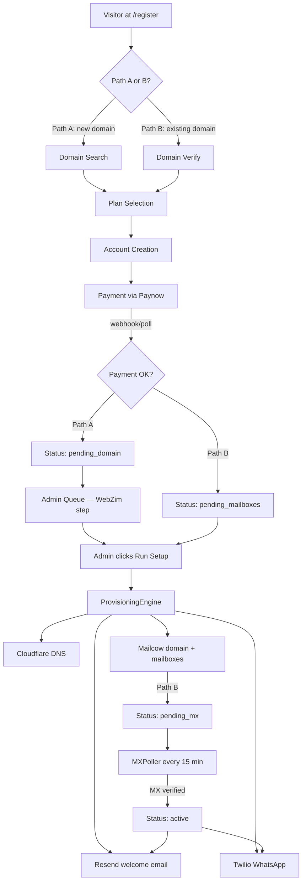

# Design Document: Self-Service Onboarding

## Overview

This feature replaces the admin-invitation flow with a fully self-service signup system. Prospective clients visit `/register`, choose between registering a new `.co.zw` domain (Path A) or hosting email on an existing domain (Path B), complete payment via Paynow Zimbabwe, and are automatically provisioned. The only manual admin step is registering a new domain on WebZim before triggering automated DNS and mailbox setup.

The system is built on the existing React/Vite + Node.js/Express + Supabase stack. New integrations are added as isolated service modules following the same pattern as the existing `mailcow.ts` and `domainCheck.ts` services.

---

## Architecture

### High-Level Flow



### New Routes

**Client (React Router)**
- `/register` — multi-step registration page (public)
- `/register/confirm` — post-payment status tracker (public, keyed by client ID in URL)

**Server (Express)**
- `POST /api/register` — create Supabase auth user + client record, return client ID
- `POST /api/payments/initiate` — create Paynow payment request, return redirect URL
- `POST /api/payments/webhook` — Paynow result URL callback
- `GET  /api/payments/poll/:clientId` — client-side polling fallback
- `POST /api/clients/:id/provision` — trigger ProvisioningEngine (admin-only)
- `GET  /api/clients/:id/verify-mx` — manual MX check trigger (admin-only)

### New Server Services

| Service | File | Responsibility |
|---|---|---|
| `ProvisioningEngine` | `server/src/services/provisioning.ts` | Orchestrates full provisioning sequence |
| `PaynowService` | `server/src/services/paynow.ts` | Wraps `paynow` npm package |
| `CloudflareService` | `server/src/services/cloudflare.ts` | Wraps `cloudflare` npm package |
| `ResendService` | `server/src/services/resend.ts` | Wraps `resend` npm package |
| `TwilioService` | `server/src/services/twilio.ts` | Wraps Twilio REST API for WhatsApp |
| `MXPoller` | `server/src/jobs/mxPoller.ts` | `node-cron` job, polls Google DNS |
| `envGuard` | `server/src/lib/envGuard.ts` | Validates required env vars at startup |

### New Client Components

| Component | Path | Responsibility |
|---|---|---|
| `RegisterPage` | `client/src/pages/RegisterPage.tsx` | Page shell, step router |
| `PathToggle` | `client/src/components/register/PathToggle.tsx` | Path A / Path B selector |
| `StepDomainSearch` | `client/src/components/register/StepDomainSearch.tsx` | Path A domain search + alternatives |
| `StepDomainVerify` | `client/src/components/register/StepDomainVerify.tsx` | Path B domain verify + MX detect |
| `StepPlanSelect` | `client/src/components/register/StepPlanSelect.tsx` | Plan cards with fee display |
| `StepAccount` | `client/src/components/register/StepAccount.tsx` | Account fields + ZISPA checklist (Path A) |
| `StepPayment` | `client/src/components/register/StepPayment.tsx` | Paynow redirect + polling |
| `StepDnsInstructions` | `client/src/components/register/StepDnsInstructions.tsx` | Path B DNS setup instructions |
| `StatusTracker` | `client/src/components/register/StatusTracker.tsx` | Real-time provisioning status |
| `ConfirmPage` | `client/src/pages/ConfirmPage.tsx` | Post-payment confirmation + StatusTracker |
| `useRegistration` | `client/src/hooks/useRegistration.ts` | Form state machine hook |
| `AdminQueue` | `client/src/components/admin/AdminQueue.tsx` | Pending clients section on ClientsPage |

---

## Components and Interfaces

### RegisterPage — Step Machine

`RegisterPage` owns a `step` state and renders the appropriate step component. Steps are numbered 1–5 per path.

```
Path A: PathToggle → StepDomainSearch → StepPlanSelect → StepAccount → StepPayment → ConfirmPage
Path B: PathToggle → StepDomainVerify → StepPlanSelect → StepAccount → StepPayment → StepDnsInstructions → ConfirmPage
```

The `useRegistration` hook holds all accumulated form state and exposes typed setters. It is passed down as props to each step component.

### StepDomainSearch

- Reuses the existing 800ms debounce pattern from `RegistrationForm.tsx`
- Calls `GET /api/domains/check?name=&tld=.co.zw`
- On `taken` result, calls `GET /api/domains/suggest?name=` to fetch 3 alternatives
- Alternatives rendered as clickable chips that call `setDomain(alt)`

### StepDomainVerify

- Calls `GET /api/domains/check?name=&tld=` (any TLD)
- On confirmed-registered result, calls `GET /api/domains/mx?domain=` to detect current provider
- Displays detected provider or "No current email provider detected"

### StepPlanSelect

- Renders three plan cards: Starter ($3), Business ($10), Pro ($18)
- Reads `path` from `useRegistration` to conditionally add `+$5` domain fee line
- Selected plan card gets a highlighted border using `--primary` token

### StepAccount

- Renders common fields: full name, company name, phone, email, password, physical address
- Conditionally renders ZISPA checklist when `path === 'A'`
- On blur of email field, calls `GET /api/register/check-email?email=` for duplicate check
- Client-side validation runs on "Continue" click before API call

### StepPayment

- Calls `POST /api/payments/initiate` with `{ clientId, amount, email, phone }`
- Receives `{ redirectUrl, pollUrl }` and opens Paynow in new tab
- Polls `GET /api/payments/poll/:clientId` every 5 seconds while tab is open
- On confirmed payment, navigates to `/register/confirm?id=:clientId`

### StatusTracker

- Subscribes to Supabase Realtime channel `clients:id=eq.:clientId`
- Renders an ordered step list with the current step highlighted
- Step definitions differ by path (Path A includes `pending_domain`)
- On `provisioning_error`, renders an error card with support contact

### AdminQueue

- Rendered at the top of `ClientsPage` when any clients have status in `['pending_domain', 'pending_mailboxes']`
- Each row shows: domain, company name, plan, time since registration, status badge
- "Run setup" button calls `POST /api/clients/:id/provision`
- Uses optimistic UI — button shows spinner while request is in flight

### API Route Interfaces

```typescript
// POST /api/register
interface RegisterRequest {
  path: 'A' | 'B';
  domain: string;
  plan: 'starter' | 'business' | 'pro';
  company_name: string;
  full_name: string;
  email: string;
  password: string;
  phone: string;
  physical_address: string;
  // Path A only
  letterhead_ready?: boolean;
  signed_letter_ready?: boolean;
  id_ready?: boolean;
  tc_confirmed?: boolean;
}
interface RegisterResponse {
  clientId: string;
  userId: string;
}

// POST /api/payments/initiate
interface PaymentInitiateRequest {
  clientId: string;
  amount: number;
  email: string;
  phone: string;
}
interface PaymentInitiateResponse {
  redirectUrl: string;
  pollUrl: string;
  reference: string;
}

// POST /api/payments/webhook (Paynow result URL)
// Body is Paynow's URL-encoded form post

// POST /api/clients/:id/provision
// No body — admin-only, uses client record from DB
interface ProvisionResponse {
  success: boolean;
  mailboxesCreated: number;
}
```

---

## Data Models

### clients table — new columns (migration 009)

```sql
ALTER TABLE clients
  ADD COLUMN domain_owned        BOOLEAN NOT NULL DEFAULT false,
  ADD COLUMN mx_verified         BOOLEAN NOT NULL DEFAULT false,
  ADD COLUMN mx_verified_at      TIMESTAMPTZ,
  ADD COLUMN previous_email_provider TEXT,
  ADD COLUMN paynow_reference    TEXT,
  ADD COLUMN physical_address    TEXT;

-- Expand status CHECK constraint
ALTER TABLE clients DROP CONSTRAINT clients_status_check;
ALTER TABLE clients ADD CONSTRAINT clients_status_check
  CHECK (status IN (
    'active', 'suspended', 'pending',
    'pending_payment', 'pending_domain', 'pending_dns',
    'pending_mailboxes', 'pending_mx', 'provisioning_error'
  ));
```

### Updated TypeScript types

```typescript
// Addition to client/src/types/index.ts
export type ClientStatus =
  | 'active' | 'suspended' | 'pending'
  | 'pending_payment' | 'pending_domain' | 'pending_dns'
  | 'pending_mailboxes' | 'pending_mx' | 'provisioning_error';

export interface Client {
  // ... existing fields ...
  domain_owned: boolean;
  mx_verified: boolean;
  mx_verified_at: string | null;
  previous_email_provider: string | null;
  paynow_reference: string | null;
  physical_address: string | null;
}
```

### ProvisioningEngine internal state

```typescript
interface ProvisioningContext {
  clientId: string;
  domain: string;
  plan: Plan;
  path: 'A' | 'B';
  mailboxes: Array<{ localPart: string; quotaMb: number; password: string }>;
}

// Plan mailbox definitions
const PLAN_MAILBOXES: Record<Plan, Array<{ localPart: string; quotaMb: number }>> = {
  starter:  [{ localPart: 'info', quotaMb: 500 }],
  business: [
    { localPart: 'info',     quotaMb: 1024 },
    { localPart: 'admin',    quotaMb: 1024 },
    { localPart: 'sales',    quotaMb: 1024 },
    { localPart: 'support',  quotaMb: 1024 },
    { localPart: 'accounts', quotaMb: 1024 },
  ],
  pro: [
    { localPart: 'info',      quotaMb: 2048 },
    { localPart: 'admin',     quotaMb: 2048 },
    { localPart: 'sales',     quotaMb: 2048 },
    { localPart: 'support',   quotaMb: 2048 },
    { localPart: 'accounts',  quotaMb: 2048 },
    { localPart: 'hr',        quotaMb: 2048 },
    { localPart: 'ceo',       quotaMb: 2048 },
    { localPart: 'finance',   quotaMb: 2048 },
    { localPart: 'marketing', quotaMb: 2048 },
    { localPart: 'ops',       quotaMb: 2048 },
  ],
};
```

### Supabase Realtime subscription pattern

```typescript
// In StatusTracker component
const channel = supabase
  .channel(`client-status-${clientId}`)
  .on(
    'postgres_changes',
    { event: 'UPDATE', schema: 'public', table: 'clients', filter: `id=eq.${clientId}` },
    (payload) => setStatus(payload.new.status as ClientStatus)
  )
  .subscribe();

// Cleanup on unmount
return () => { supabase.removeChannel(channel); };
```

### MXPoller job

```typescript
// server/src/jobs/mxPoller.ts
import cron from 'node-cron';

// Runs every 15 minutes
cron.schedule('*/15 * * * *', async () => {
  const pendingClients = await getPendingMxClients();
  for (const client of pendingClients) {
    await checkAndUpdateMx(client);
  }
});

async function checkAndUpdateMx(client: Client): Promise<void> {
  try {
    const mxRecords = await queryGoogleDns(client.domain);
    const verified = mxRecords.some(r => r.exchange.includes(MAILCOW_HOST));
    if (verified) {
      await updateClientMxVerified(client.id);
      await provisioningEngine.sendActivationNotifications(client);
    }
  } catch (err) {
    logger.error({ clientId: client.id, err }, 'MX poll failed');
    // No status change on error — retry next interval
  }
}
```

### Google DNS API query

```typescript
// No API key required
async function queryGoogleDns(domain: string): Promise<MxRecord[]> {
  const url = `https://dns.google/resolve?name=${domain}&type=MX`;
  const res = await fetch(url);
  const data = await res.json();
  return (data.Answer ?? []).map((r: { data: string }) => {
    const [priority, exchange] = r.data.split(' ');
    return { priority: Number(priority), exchange };
  });
}
```

---

## Correctness Properties

*A property is a characteristic or behavior that should hold true across all valid executions of a system — essentially, a formal statement about what the system should do. Properties serve as the bridge between human-readable specifications and machine-verifiable correctness guarantees.*

### Property 1: Path switching resets domain fields

*For any* non-empty domain input value, switching between Path A and Path B should result in the domain field being cleared and the availability state returning to `idle`.

**Validates: Requirements 1.4**

---

### Property 2: Unavailable domain returns at least 3 alternatives

*For any* domain name that is reported as taken by the Domain_Checker, the suggestions endpoint should return at least 3 distinct alternative domain names, each ending in `.co.zw`.

**Validates: Requirements 2.3**

---

### Property 3: Alternative chip selection auto-populates domain field

*For any* list of alternative domain suggestions, clicking any suggestion chip should set the domain input field to exactly that suggestion's name (without the TLD suffix).

**Validates: Requirements 2.4**

---

### Property 4: Path A domain checker rejects non-.co.zw domains

*For any* domain string that does not end in `.co.zw`, the Path A Domain_Checker should return a validation error and not proceed to the WhoisJSON or DNS lookup.

**Validates: Requirements 2.6**

---

### Property 5: Detected email provider stored on client record

*For any* Path B registration where MX records are detected, the `previous_email_provider` field on the resulting client record should equal the provider name derived from those MX records.

**Validates: Requirements 3.6**

---

### Property 6: Fee calculation is path-dependent

*For any* plan selection, the total amount displayed and charged should equal the plan's monthly price plus $5 when on Path A, and equal the plan's monthly price alone when on Path B.

**Validates: Requirements 4.2, 4.3, 7.6**

---

### Property 7: URL plan parameter pre-selects plan on load

*For any* valid plan value (`starter`, `business`, `pro`) passed as a `?plan=` URL query parameter, the plan selection step should initialise with that plan already selected.

**Validates: Requirements 4.6**

---

### Property 8: Path A validation rejects incomplete submissions

*For any* Path A account creation submission where at least one required field is empty or at least one ZISPA checklist item is unchecked, the form should display at least one inline validation error and not advance to the payment step.

**Validates: Requirements 5.3, 5.4**

---

### Property 9: Duplicate email check prevents re-registration

*For any* email address that already exists in the `profiles` table, the registration form should display a duplicate-email error and prevent form submission.

**Validates: Requirements 5.5, 6.5**

---

### Property 10: Password minimum length enforced

*For any* password string shorter than 8 characters, the account creation step should display a validation error and prevent progression to payment.

**Validates: Requirements 5.6, 6.6**

---

### Property 11: Payment confirmation triggers correct status transition

*For any* client in `pending_payment` status, a confirmed Paynow payment webhook should transition the client to `pending_domain` if `domain_owned = true` (Path A) or `pending_mailboxes` if `domain_owned = false` (Path B), and to no other status.

**Validates: Requirements 7.3**

---

### Property 12: Status_Tracker reflects every valid status with a non-empty label

*For any* valid `ClientStatus` value, the StatusTracker component should render a non-empty human-readable label string for that status step.

**Validates: Requirements 8.3, 8.4**

---

### Property 13: Path A provisioning produces an active client with correct mailboxes

*For any* client in `pending_domain` status, after the admin triggers provisioning, the client's status should be `active` and the `mailboxes` table should contain exactly the mailboxes defined for the client's plan, each with status `active`.

**Validates: Requirements 11.1–11.6, 13.1–13.3, 13.5**

---

### Property 14: Path B provisioning produces a pending_mx client with correct mailboxes

*For any* client in `pending_mailboxes` status, after the admin triggers provisioning, the client's status should be `pending_mx` and the `mailboxes` table should contain exactly the mailboxes defined for the client's plan, each with status `active`.

**Validates: Requirements 12.1–12.3**

---

### Property 15: Generated mailbox passwords are unique and sufficiently long

*For any* provisioning run, all generated mailbox passwords should be at least 16 characters long, and no two passwords generated in the same run should be identical.

**Validates: Requirements 13.4**

---

### Property 16: MX verification triggers active transition

*For any* client in `pending_mx` status whose domain's MX records point to the Mailcow server, the MX_Poller should set `mx_verified = true`, `mx_verified_at` to a non-null timestamp, and `status` to `active`.

**Validates: Requirements 14.3, 14.4**

---

### Property 17: Active transition via MX_Poller triggers notifications

*For any* client whose status transitions to `active` via MX verification, the system should dispatch both a welcome email via Resend and a WhatsApp notification via Twilio.

**Validates: Requirements 14.5**

---

### Property 18: Missing required env var causes startup failure

*For any* required environment variable (`PAYNOW_INTEGRATION_ID`, `PAYNOW_INTEGRATION_KEY`, `CLOUDFLARE_API_TOKEN`, `CLOUDFLARE_ACCOUNT_ID`, `RESEND_API_KEY`, `TWILIO_ACCOUNT_SID`, `TWILIO_AUTH_TOKEN`, `TWILIO_WHATSAPP_FROM`, `APP_URL`) that is absent at server startup, the process should log a descriptive error naming the missing variable and exit with a non-zero status code.

**Validates: Requirements 16.6**

---

### Property 19: Registration round-trip data integrity

*For any* valid registration form submission, reading the resulting `clients` and `profiles` records back from the database should return values equivalent to those submitted — including domain, plan, company name, contact details, physical address, and `domain_owned` flag.

**Validates: Requirements 17.1–17.4**

---

## Error Handling

### ProvisioningEngine step failures

Each step in the provisioning sequence is wrapped in a try/catch. On any failure:
1. The error is logged with `clientId`, step name, and error details to the server console (and optionally a `provisioning_logs` table for future audit).
2. The client status is set to `provisioning_error`.
3. The Supabase Realtime subscription in `StatusTracker` picks up the status change and renders the error state with a support contact prompt.

The engine does **not** attempt automatic rollback — partial provisioning state (e.g., a Cloudflare zone created but Mailcow domain not yet added) is left for admin review. The admin can re-trigger provisioning after fixing the underlying issue.

### Paynow payment failures

- If the Paynow redirect URL cannot be obtained, `POST /api/payments/initiate` returns a 502 with `{ error: 'Payment gateway unavailable' }`.
- If the webhook arrives with a failed status, the client status remains `pending_payment` and the client-side polling loop surfaces a retry button.
- Paynow poll timeout (no confirmation after 30 minutes) leaves the client in `pending_payment` — the admin can manually advance or refund.

### MX polling errors

- Google DNS API errors are caught per-client in the polling loop.
- The error is logged; the client status is not changed.
- The poller continues to the next client and retries on the next 15-minute interval.

### Environment variable validation

`envGuard.ts` is called at the top of `server/src/index.ts` before any routes are registered. It checks all required variables and calls `process.exit(1)` with a descriptive message if any are missing.

### Duplicate email on registration

`POST /api/register` calls `supabase.auth.admin.listUsers()` or a direct `profiles` table query to check for existing email before creating the auth user. Returns `409 Conflict` with `{ error: 'Email already registered', code: 'EMAIL_EXISTS' }`.

---

## Testing Strategy

### Dual approach

Both unit/example tests and property-based tests are required. Unit tests cover specific examples, integration points, and error conditions. Property tests verify universal correctness across randomised inputs.

### Property-based testing library

**Server (Node.js):** `fast-check` — `npm install --save-dev fast-check`  
**Client (Vitest):** `fast-check` — already compatible with Vitest's test runner

Each property test must run a minimum of **100 iterations** (fast-check default is 100; set `{ numRuns: 100 }` explicitly).

Each test must include a comment tag:
```
// Feature: self-service-onboarding, Property N: <property text>
```

### Property test mapping

| Property | Test file | fast-check arbitraries |
|---|---|---|
| P1: Path switching resets domain | `client/src/__tests__/pathSwitchReset.property.test.tsx` | `fc.string()` for domain value |
| P2: ≥3 alternatives for taken domain | `server/src/routes/__tests__/domainSuggest.property.test.ts` | `fc.string()` for domain name |
| P3: Alternative chip populates field | `client/src/__tests__/alternativeChipAutoCheck.property.test.tsx` | `fc.array(fc.string(), {minLength:3})` |
| P4: Path A rejects non-.co.zw | `server/src/services/__tests__/domainCheck.property.test.ts` | `fc.string()` filtered to non-.co.zw |
| P5: Provider stored on client | `server/src/routes/__tests__/register.property.test.ts` | `fc.string()` for provider name |
| P6: Fee calculation | `client/src/__tests__/feeCalculation.property.test.tsx` | `fc.constantFrom('starter','business','pro')`, `fc.constantFrom('A','B')` |
| P7: URL plan param pre-selects | `client/src/__tests__/planPreSelection.property.test.tsx` | `fc.constantFrom('starter','business','pro')` |
| P8: Path A validation rejects incomplete | `client/src/__tests__/registrationFormValidation.property.test.tsx` | `fc.record(...)` with missing fields |
| P9: Duplicate email check | `server/src/routes/__tests__/register.property.test.ts` | `fc.emailAddress()` |
| P10: Password min length | `client/src/__tests__/registrationFormValidation.property.test.tsx` | `fc.string({maxLength:7})` |
| P11: Payment status transition | `server/src/routes/__tests__/payments.property.test.ts` | `fc.constantFrom('A','B')` |
| P12: StatusTracker labels | `client/src/__tests__/statusTrackerLabels.property.test.tsx` | `fc.constantFrom(...ClientStatus values)` |
| P13: Path A provisioning end state | `server/src/services/__tests__/provisioning.property.test.ts` | `fc.constantFrom('starter','business','pro')` |
| P14: Path B provisioning end state | `server/src/services/__tests__/provisioning.property.test.ts` | same |
| P15: Password uniqueness and length | `server/src/services/__tests__/provisioning.property.test.ts` | `fc.integer({min:1, max:10})` for count |
| P16: MX verification state transition | `server/src/jobs/__tests__/mxPoller.property.test.ts` | `fc.string()` for domain |
| P17: Active transition triggers notifications | `server/src/jobs/__tests__/mxPoller.property.test.ts` | same |
| P18: Missing env var exits | `server/src/lib/__tests__/envGuard.property.test.ts` | `fc.subarray([...required vars])` |
| P19: Round-trip data integrity | `server/src/routes/__tests__/register.property.test.ts` | `fc.record(...)` for full registration payload |

### Unit test coverage

- `StepDomainSearch` — renders availability states (idle, loading, available, taken, degraded, error)
- `StepPlanSelect` — renders correct prices and mailbox counts per plan
- `StepAccount` — ZISPA checklist present for Path A, absent for Path B
- `StatusTracker` — renders correct step sequence for Path A vs Path B
- `ProvisioningEngine` — each step called in correct order (mock services)
- `PaynowService` — correct payload construction
- `CloudflareService` — zone creation and DNS record addition
- `ResendService` — welcome email template rendering
- `MXPoller` — skips clients not in `pending_mx`, processes those that are
- Migration 009 — columns exist with correct defaults (integration test against test DB)
